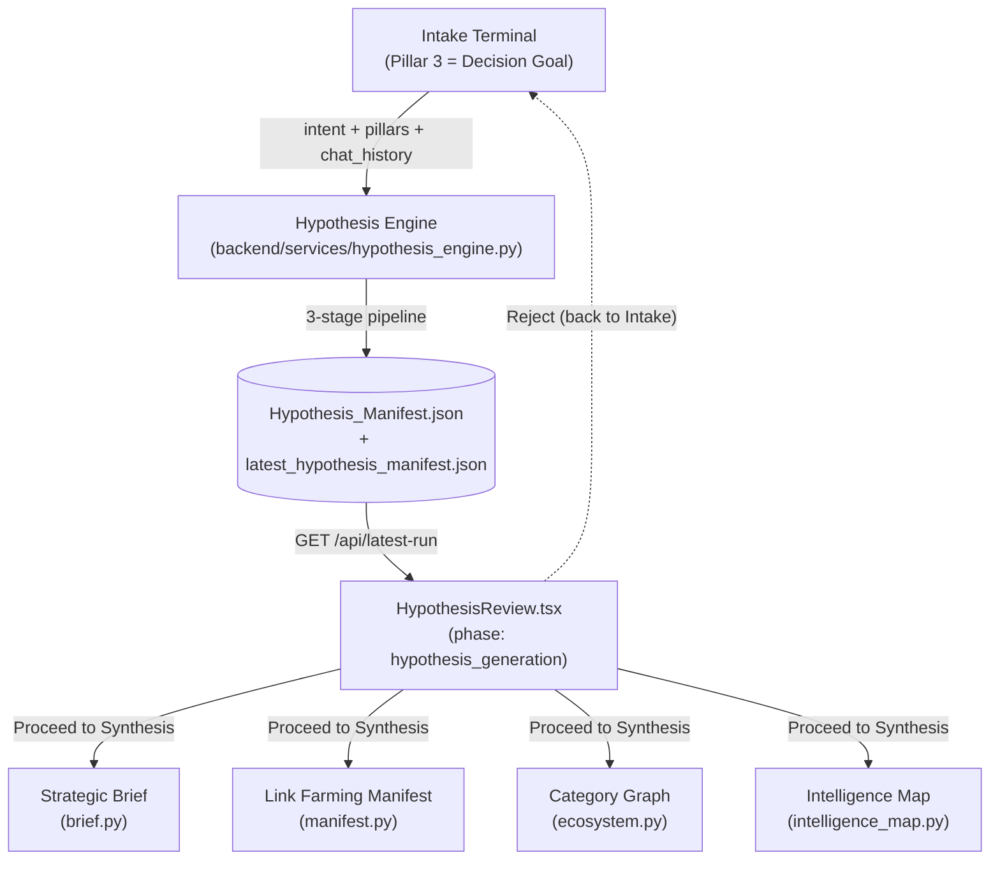
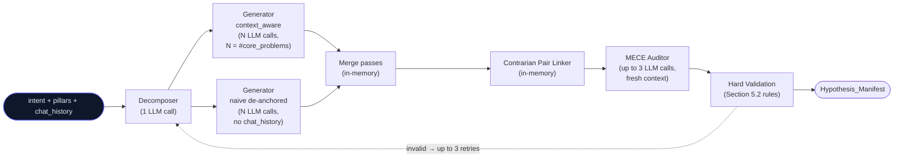
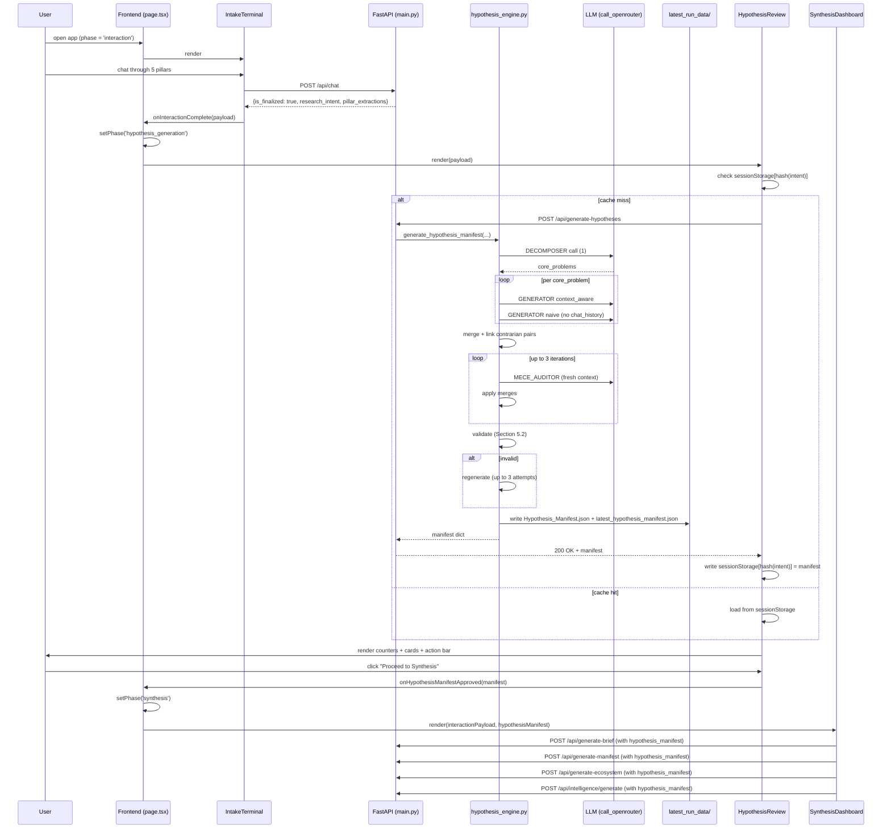
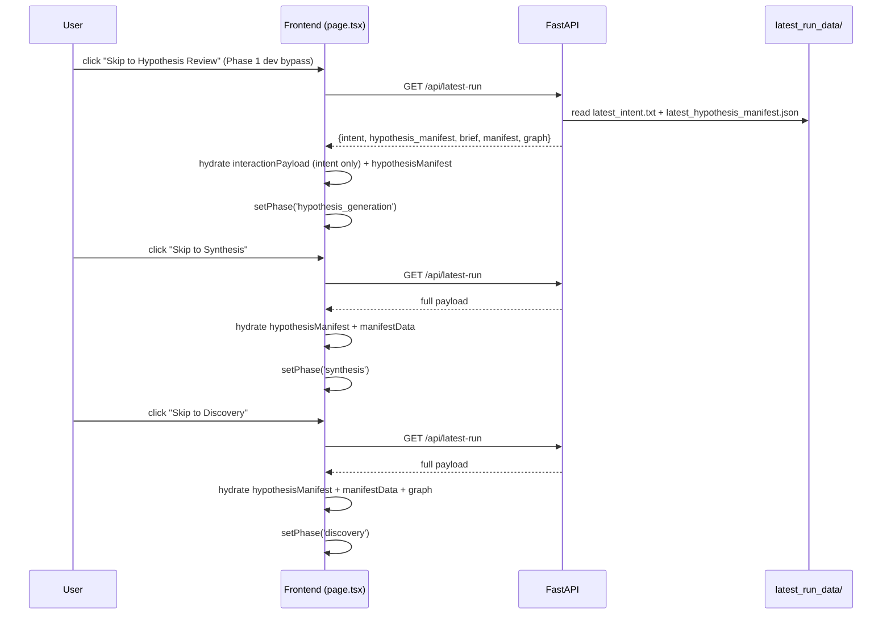
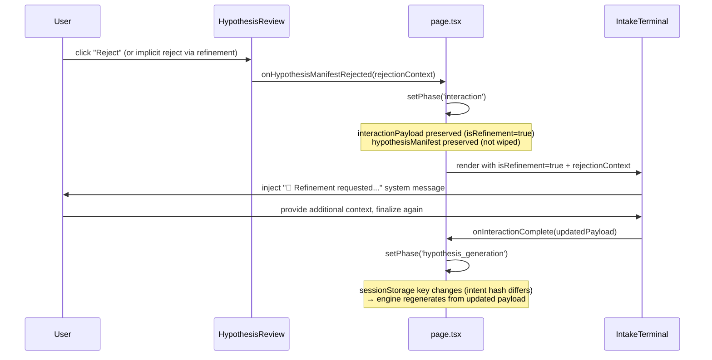
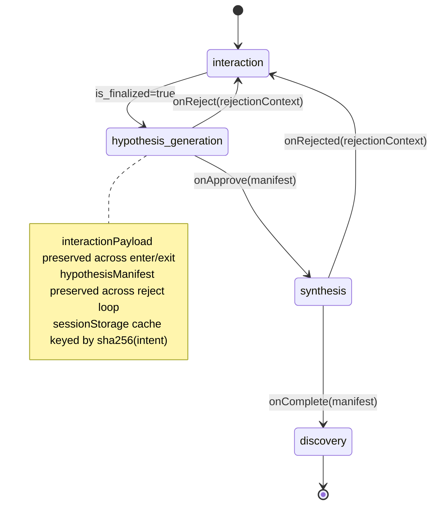

# Design Document

## Overview

The Hypothesis Engine is a new first-class stage of the Outtlyr Nucleus Ingestion Platform (Module 1) that elevates hypothesis generation from a scattered byproduct of three downstream modules into a single dedicated service. The engine sits between Intake (`IntakeTerminal`) and Synthesis (`SynthesisDashboard`). It consumes the locked intent + full pillar payload after `is_finalized: true`, runs three internal stages — Decomposition, Generation (with a de-anchored second pass), and MECE Audit — and emits a structured **Hypothesis Manifest** persisted as `backend/Hypothesis_Manifest.json` and `backend/latest_run_data/latest_hypothesis_manifest.json`.

The Hypothesis Manifest becomes the single source of truth for four downstream artifacts:

- Strategic Brief (`backend/api/brief.py`)
- Link Farming Manifest (`backend/api/manifest.py`)
- Category Graph (`backend/api/ecosystem.py`)
- Intelligence Map (`backend/api/intelligence_map.py`)

The frontend gains a new phase `hypothesis_generation` between `interaction` and `synthesis`, rendered by a new component `HypothesisReview.tsx`. The Intake Terminal's Pillar 3 is refactored from "Target Lens & Hypothesis" to "Target Lens & Decision Goal" so the client is no longer asked to articulate a hypothesis — eliminating confirmation bias at the source.

All downstream endpoints accept the manifest as an **optional** parameter and retain their current behavior when the manifest is absent. This backward-compatibility shim allows the engine to ship before downstream consumers migrate, and supports the five-sprint sequencing in Section 16 of the source update spec.

### Key Design Decisions

| Decision | Rationale |
|---|---|
| Separate engine module (`backend/services/hypothesis_engine.py`) | Stateless service; no API leakage into the brief/intelligence_map modules; testable in isolation |
| Single KB file with `[DECOMPOSER]` / `[GENERATOR]` / `[MECE_AUDITOR]` markers | Matches existing kb_loader mtime-cache pattern; one file to edit prompts; hot-reload without restart |
| De-anchored generation merges two LLM calls per problem | Naive pass surfaces unknown unknowns the context-aware pass would miss |
| Three-iteration MECE audit with `mece_audit_passed: false` fallback | Bounded retry; engine still returns a manifest if audit cannot converge — UI surfaces the warning |
| Optional `hypothesis_manifest` on all four downstream endpoints | Backward-compatible shim; sprints can ship independently |
| Auto-proceed default at Hypothesis Review | Aligns with "Open Items" decision in Section 15 of the update spec; "Modify Hypotheses" remains accessible from Synthesis Review |
| `sessionStorage` cache keyed by intent hash | Prevents redundant LLM spend during hot-reloads in development |

### Source Documents

- Requirements: `.kiro/specs/hypothesis-engine/requirements.md`
- Source spec: `UPDATE_HYPOTHESIS_GENERATION.md` (Section 5 schema, Section 7 MECE strategy, Section 9 UI, Section 16 sprints)
- Existing engine prototype (worktree, used as reference): `.claude/worktrees/epic-noyce-a6817c/backend/services/hypothesis_engine.py`

---

## Architecture

### High-Level Pipeline (After This Update)



### Internal Engine Topology



### Live-Run Sequence Diagram



### Dev Bypass Sequence Diagram



### Rejection Loop Sequence Diagram



---

## Components and Interfaces

### Component Inventory

| Layer | Component | Path | Status |
|---|---|---|---|
| Backend service | `hypothesis_engine` | `backend/services/hypothesis_engine.py` | NEW |
| Backend KB | `hypothesis_agent.md` | `backend/kb/agents/hypothesis_agent.md` | NEW |
| Backend API | `hypotheses` router | `backend/api/hypotheses.py` | NEW |
| Backend API | `brief` router | `backend/api/brief.py` | MODIFIED (+ optional manifest) |
| Backend API | `manifest` router | `backend/api/manifest.py` | MODIFIED (+ optional manifest) |
| Backend API | `ecosystem` router | `backend/api/ecosystem.py` | MODIFIED (+ optional manifest, hypothesis_anchor nodes) |
| Backend API | `intelligence_map` router | `backend/api/intelligence_map.py` | MODIFIED (manifest as primary source) |
| Backend API | `dev_bypass` router | `backend/api/dev_bypass.py` | MODIFIED (+ hypothesis_manifest field, missing-files tolerance) |
| Backend API | `intake` router | `backend/api/intake.py` | MODIFIED (Pillar 3 label only — scoring already covered by KB edit) |
| Backend KB | `intake_agent.md` + 6 archetype files | `backend/kb/agents/{intake_agent,intake_archetypes/*}.md` | MODIFIED (strip hypothesis elicitation) |
| Backend KB | `brief_agent.md` | `backend/kb/agents/brief_agent.md` | MODIFIED (render manifest, do not generate) |
| Backend bootstrap | `main.py` | `backend/main.py` | MODIFIED (register hypotheses router) |
| Frontend page | `page.tsx` | `frontend/src/app/page.tsx` | MODIFIED (phase machine + hypothesisManifest state) |
| Frontend component | `IntakeTerminal.tsx` | `frontend/src/components/IntakeTerminal.tsx` | MODIFIED (Pillar 3 label) |
| Frontend component | `HypothesisReview.tsx` | `frontend/src/components/HypothesisReview.tsx` | NEW |
| Frontend component | `SynthesisDashboard.tsx` | `frontend/src/components/SynthesisDashboard.tsx` | MODIFIED (accept hypothesisManifest prop, forward to all four API calls) |
| Frontend types | `types/hypothesis.ts` | `frontend/src/types/hypothesis.ts` | NEW |

### Backend Service: `backend/services/hypothesis_engine.py`

**Public function signature:**

```python
def generate_hypothesis_manifest(
    intent: str,
    pillar_extractions: Dict[str, Any] | None = None,
    pillar_scores: List[Dict[str, Any]] | None = None,
    context_document: Optional[str] = None,
    template: Optional[str] = None,
    chat_history: List[Dict[str, str]] | None = None,
) -> Dict[str, Any]:
    """
    Orchestrate the 3-stage hypothesis generation pipeline.

    Returns a Hypothesis Manifest matching the schema in Section 5 of
    UPDATE_HYPOTHESIS_GENERATION.md.

    Stateless. No module-level mutable globals. Persists the manifest to
    disk as a side effect (Hypothesis_Manifest.json + latest_run_data/).
    """
```

**Module-level constants:**

```python
SCHEMA_VERSION = "1.0"
MIN_EXPECTED_SIGNALS = 3
MAX_MECE_AUDIT_ITERATIONS = 3
MAX_GENERATION_RETRIES = 3

STRUCTURAL_DIMENSIONS = [
    "price", "product", "brand_perception", "distribution",
    "cultural_identity", "regulatory", "demographic_shift",
    "competitive_shift", "situational_context", "identity_expression",
]

VALID_FORCES = {
    "demand_gravity", "choice_architecture_pressure", "value_elasticity_field",
    "reinforcement_stability", "competitive_energy_field",
}

VALID_PRIORITIES = {"high", "medium", "low"}
VALID_GEN_SOURCES = {"context_aware", "naive", "contrarian_pair"}
```

**Internal helpers (private, prefixed `_`):**

```python
def _load_subprompt(stage: str) -> str: ...
    # stage ∈ {"DECOMPOSER", "GENERATOR", "MECE_AUDITOR"}
    # parses hypothesis_agent.md by [STAGE] markers via regex
    # raises ValueError if marker missing (fail loud — KB mis-edit is a bug)

def _decompose_intent(
    intent: str,
    pillar_extractions: dict | None,
    pillar_scores: list | None,
    template: str | None,
) -> List[Dict[str, Any]]: ...
    # 1 LLM call, expect_json=True
    # Returns list of core_problem dicts with deterministic IDs cp_001, cp_002, ...
    # Each entry has: id, statement, priority, decomposed_from_intent=True,
    #   decomposition_rationale.

def _generate_for_problem(
    core_problem: dict,
    intent: str,
    pillar_extractions: dict | None,
    context_document: str | None,
    chat_history: list | None,
    template: str | None,
    mode: str,  # "context_aware" or "naive"
) -> Dict[str, Any]: ...
    # 1 LLM call. If mode="naive": pillar_extractions=None, context_document=None,
    #   chat_history=None, template=None passed to LLM regardless of caller args.
    # Returns {"hypotheses": [...], "dimensions_covered": [...]}.

def _merge_passes(
    context_result: dict,
    naive_result: dict,
) -> Dict[str, Any]: ...
    # Pure function. Concatenates context_aware hypotheses with naive ones whose
    # mece_cluster_id was not seen in the context_aware set. Unions
    # dimensions_covered.

def _generate_contrarian_pairs(
    hypotheses: List[dict],
) -> List[Dict[str, Any]]: ...
    # Pure function (NO LLM call — pairing is requested in-prompt to GENERATOR).
    # 1. Assigns deterministic IDs h_001, h_002, ...
    # 2. Links pairs that share a cluster prefix when LLM omitted contrarian_pair_id.
    # 3. For unpaired hypotheses, sets contrarian_pair_id=None and appends a
    #    "no meaningful contrarian opposite" sentence to rationale (idempotent).

def _run_mece_audit(hypotheses: List[dict]) -> Dict[str, Any]: ...
    # 1 LLM call with FRESH context (no chat_history passed).
    # Sends a minimal id+statement+dimension+cluster summary to keep token cost down.
    # Returns {"merges": [...], "audit_passed": bool, "audit_notes": str}.

def _apply_merges(
    hypotheses: List[dict],
    merges: List[dict],
) -> List[Dict[str, Any]]: ...
    # Pure function. Removes merged hypotheses, inserts merged replacements,
    # re-numbers IDs to h_001 ... h_NNN, re-links contrarian_pair_id references
    # whose target was removed (sets target → None + appends rationale).

def _validate_manifest(manifest: dict) -> tuple[bool, List[str]]: ...
    # Pure function. Applies all five Hard Validation Rules from Section 5.2.
    # Returns (is_valid, errors). Caller decides retry vs. surface to API layer.
```

**Stage execution flow (algorithm pseudocode):**

```
function generate_hypothesis_manifest(intent, pillars, scores, ctx, template, history):
    for retry in 1..MAX_GENERATION_RETRIES:
        core_problems = _decompose_intent(intent, pillars, scores, template)
        if len(core_problems) == 0:
            continue  # invalid → retry

        all_hyps = []
        dimensions_covered = set()
        de_anchored_pass_count = 0

        for cp in core_problems:
            ctx_result = _generate_for_problem(cp, intent, pillars, ctx, history, template, "context_aware")
            naive_result = _generate_for_problem(cp, intent, None, None, None, None, "naive")
            de_anchored_pass_count += 1
            merged = _merge_passes(ctx_result, naive_result)
            for h in merged["hypotheses"]: h["_cp_id"] = cp["id"]
            all_hyps.extend(merged["hypotheses"])
            dimensions_covered |= set(merged["dimensions_covered"])

        all_hyps = _generate_contrarian_pairs(all_hyps)

        mece_audit_passed = True
        mece_iterations = 0
        for iteration in 1..MAX_MECE_AUDIT_ITERATIONS:
            mece_iterations += 1
            audit = _run_mece_audit(all_hyps)
            if not audit["merges"]:
                mece_audit_passed = bool(audit.get("audit_passed", True))
                break
            all_hyps = _apply_merges(all_hyps, audit["merges"])
            if iteration == MAX_MECE_AUDIT_ITERATIONS and not audit.get("audit_passed", False):
                mece_audit_passed = False  # audit did not converge

        manifest = _assemble_manifest(intent, core_problems, all_hyps, dimensions_covered,
                                       mece_audit_passed, mece_iterations, de_anchored_pass_count)

        is_valid, errors = _validate_manifest(manifest)
        if is_valid:
            _persist(manifest)
            return manifest
        # invalid → loop with stricter constraints (next retry)

    # All retries exhausted → return last manifest with mece_audit_passed=false
    # and metadata.validation_errors populated. API layer will return 422.
    manifest["metadata"]["validation_errors"] = errors
    manifest["metadata"]["mece_audit_passed"] = False
    _persist(manifest)
    return manifest
```

**Persistence helper:**

```python
def _persist(manifest: dict) -> None:
    """Write Hypothesis_Manifest.json + latest_run_data/latest_hypothesis_manifest.json."""
    pathlib.Path("Hypothesis_Manifest.json").write_text(
        json.dumps(manifest, indent=2), encoding="utf-8"
    )
    capture_dir = pathlib.Path("latest_run_data")
    capture_dir.mkdir(exist_ok=True)
    (capture_dir / "latest_hypothesis_manifest.json").write_text(
        json.dumps(manifest, indent=2), encoding="utf-8"
    )
```

### Backend KB: `backend/kb/agents/hypothesis_agent.md`

A single Markdown file with three sub-prompts delimited by section markers. Parsed by `_load_subprompt(stage)` via regex `\[STAGE_NAME\]\s*\n(.+?)(?=\n---\s*\n\[|\Z)`.

```markdown
# Hypothesis Engine — Multi-Stage Agent Prompts

This KB file contains three sub-prompts. The hypothesis engine selects the correct
sub-prompt by stage. Sub-prompts are delimited by `[STAGE_NAME]` markers.

---

[DECOMPOSER]
You are the Outtlyr Hypothesis Decomposer. ...
(Output: {"core_problems": [{"id", "statement", "priority", "decomposition_rationale"}]})

---

[GENERATOR]
You are the Outtlyr Hypothesis Generator. ...
- MUST evaluate all 10 STRUCTURAL_DIMENSIONS
- MUST emit contrarian pairs within the same dimension via mece_cluster_id grouping
- MUST set contrarian_pair_id=null with rationale-justified explanation when no opposite exists
- MUST emit minimum 3 expected_signals per hypothesis
- MUST set generation_source per the GENERATION_MODE the orchestrator passes
(Output: {"dimensions_covered": [...], "hypotheses": [{...}]})

---

[MECE_AUDITOR]
You are the Outtlyr MECE Auditor. ...
- DO NOT merge contrarian pairs (cross-referenced via contrarian_pair_id)
- DO NOT invent merges to look thorough — return empty array if no overlap
(Output: {"merges": [...], "audit_passed": bool, "audit_notes": str})
```

The full sub-prompt content matches the prototype in `.claude/worktrees/epic-noyce-a6817c/backend/kb/agents/hypothesis_agent.md`. Hot-reload is provided automatically by the existing `kb_loader.py` mtime cache — no changes to `kb_loader.py` are required.

### Backend API: `backend/api/hypotheses.py`

**Pydantic request model:**

```python
class PillarScore(BaseModel):
    label: str
    score: int

class ChatMessage(BaseModel):
    role: str          # "user" | "agent" | "assistant"
    content: str

class HypothesisRequest(BaseModel):
    intent: str
    pillar_extractions: Optional[Dict[str, Any]] = None
    pillar_scores: Optional[List[PillarScore]] = None
    context_document: Optional[str] = None
    template: Optional[str] = None
    chat_history: Optional[List[ChatMessage]] = None
```

**Response model:** raw `Dict[str, Any]` matching the manifest schema (Section 5 of update spec). FastAPI serializes via `JSONResponse` directly. Not wrapped in a Pydantic model so schema_version evolution does not require Python class changes.

**Endpoint handler:**

```python
@router.post("/generate-hypotheses")
def generate_hypotheses(request: HypothesisRequest):
    # 400 — intent required
    if not request.intent or not request.intent.strip():
        raise HTTPException(status_code=400, detail="intent is required")

    pillar_scores = (
        [{"label": p.label, "score": p.score} for p in request.pillar_scores]
        if request.pillar_scores else None
    )
    chat_history = (
        [{"role": m.role, "content": m.content} for m in request.chat_history]
        if request.chat_history else None
    )

    try:
        manifest = generate_hypothesis_manifest(
            intent=request.intent,
            pillar_extractions=request.pillar_extractions,
            pillar_scores=pillar_scores,
            context_document=request.context_document,
            template=request.template,
            chat_history=chat_history,
        )
    except RateLimitExhausted as e:
        raise HTTPException(status_code=429, detail=str(e))
    except Exception as e:
        # log full stack trace for ops
        logger.exception("hypothesis engine internal error")
        raise HTTPException(status_code=500, detail=str(e))

    # 422 — engine returned a manifest but it failed all 3 regen attempts
    if manifest.get("metadata", {}).get("validation_errors"):
        raise HTTPException(
            status_code=422,
            detail={
                "message": "Manifest failed hard validation after 3 regeneration attempts.",
                "errors": manifest["metadata"]["validation_errors"],
                "manifest": manifest,  # surface partial manifest for debugging
            },
        )

    return manifest
```

**Router registration in `backend/main.py`:**

```python
from api import hypotheses  # NEW
app.include_router(hypotheses.router, prefix="/api")
```

### Backend API Modifications

#### `backend/api/brief.py`

Add an optional `hypothesis_manifest` field to `BriefRequest`. When present, the endpoint passes the manifest into the LLM prompt with explicit "render, do not generate" instructions, and the `brief_agent.md` is updated accordingly.

```python
class BriefRequest(BaseModel):
    research_intent: str
    parameters: List[PillarScore]
    pillar_extractions: Optional[Dict[str, Any]] = None
    context_document: Optional[str] = None
    template: Optional[str] = None
    hypothesis_manifest: Optional[Dict[str, Any]] = None  # NEW

# Inside generate_strategic_brief(request):
manifest_block = ""
if request.hypothesis_manifest:
    manifest_block = (
        "\n\n### Pre-Generated Hypothesis Manifest (RENDER, DO NOT REGENERATE)\n"
        "```json\n" + json.dumps(request.hypothesis_manifest, indent=2)[:8000] + "\n```\n"
        "CRITICAL: The Hypotheses section of your output MUST render the manifest above as prose.\n"
        "DO NOT generate alternative hypotheses. Render exactly the hypotheses provided, one\n"
        "subsection per core_problem, contrarian pairs side-by-side."
    )
```

`brief_agent.md` is updated with a new section: *"When a Hypothesis Manifest is supplied, render its hypotheses as prose paragraphs grouped by core problem, with contrarian pairs adjacent. Use the rationale field as the body of each hypothesis paragraph."*

#### `backend/api/manifest.py`

Add an optional `hypothesis_manifest` field to `ManifestRequest`. When present, the manifest's `expected_signals` are translated into search nets, and `dimension` informs platform routing.

```python
class ManifestRequest(BaseModel):
    research_intent: str
    brief_text: str
    pillar_extractions: Optional[Dict[str, Any]] = None
    template: Optional[str] = None
    hypothesis_manifest: Optional[Dict[str, Any]] = None  # NEW

# Inside generate_link_farming_manifest:
hypothesis_block = ""
if request.hypothesis_manifest:
    hypothesis_block = _build_hypothesis_block(request.hypothesis_manifest)
    user_prompt += hypothesis_block

def _build_hypothesis_block(manifest: dict) -> str:
    """Translate hypothesis dimension+expected_signals into prompt-ready guidance."""
    DIMENSION_PLATFORMS = {
        "price": ["Amazon reviews", "deal forums", "PriceSpy"],
        "cultural_identity": ["TikTok", "Reddit r/{cohort}", "Instagram"],
        "distribution": ["Glassdoor", "trade publications"],
        "competitive_shift": ["competitor blog feeds", "press releases"],
        # ... full mapping for all 10 dimensions
    }
    # Builds a prompt suffix instructing the manifest LLM to seed search nets from
    # expected_signals and platform routes from dimension.
```

#### `backend/api/ecosystem.py`

Add an optional `hypothesis_manifest` field to `IntentPayload`. When present, the graph builder injects two new node types before passing through the normal Subject/Component/Signal hierarchy:

```python
class IntentPayload(BaseModel):
    intent: str
    brief: str | None = None
    hypothesis_manifest: Dict[str, Any] | None = None  # NEW

# Inside generate_dynamic_ecosystem_graph:
if hypothesis_manifest:
    G.add_node(core_topic, type="root", ...)
    for cp in hypothesis_manifest["core_problems"]:
        cp_node_id = f"core_problem_{cp['id']}"
        G.add_node(cp_node_id, type="core_problem", label=cp["statement"][:80],
                   color="#a855f7", size=5, priority=cp["priority"])
        G.add_edge(core_topic, cp_node_id)

        for h in cp["hypotheses"]:
            anchor_id = f"hypothesis_anchor_{h['id']}"
            G.add_node(
                anchor_id,
                type="hypothesis_anchor",        # NEW node type
                label=h["statement"][:80],
                color="#6366f1",                  # Indigo (per spec)
                size=6,                           # per spec
                hypothesis_id=h["id"],
                dimension=h["dimension"],
                force=h["force_assignment"],
                contrarian_pair_id=h.get("contrarian_pair_id"),
            )
            G.add_edge(cp_node_id, anchor_id)
            # Existing Subject/Component/Signal hierarchy hangs off anchor_id
            # rather than off core_topic.
```

When `hypothesis_manifest` is absent, the existing behavior (subjects → components → signals attached directly to root) is preserved.

#### `backend/api/intelligence_map.py`

The `IntelligenceMapRequest.manifest` field already exists but currently accepts the *Link Farming* manifest. We rename for clarity and add `hypothesis_manifest`:

```python
class IntelligenceMapRequest(BaseModel):
    intent: str
    brief: Optional[str] = None
    manifest: Optional[Dict[str, Any]] = None              # link farming manifest (existing)
    hypothesis_manifest: Optional[Dict[str, Any]] = None   # NEW
    graph_nodes: Optional[List[str]] = None
```

When `hypothesis_manifest` is provided, the topology builder populates `explicit_hypothesis` nodes from the manifest 1:1 — preserving hypothesis IDs — and instructs the LLM to skip generating new hypotheses from the intent. `suggested_hypothesis` nodes are reserved for emergent hypotheses (post-convergence anomalies; out of scope for this update beyond the reservation).

```python
# Inside generate_intelligence_map:
if request.hypothesis_manifest:
    # 1. Pre-populate explicit_hypothesis nodes from the manifest
    explicit_nodes = []
    for cp in request.hypothesis_manifest["core_problems"]:
        for h in cp["hypotheses"]:
            explicit_nodes.append({
                "id": h["id"],                  # PRESERVE hypothesis ID
                "type": "explicit_hypothesis",
                "label": h["statement"][:120],
                "force": _map_force_to_label(h["force_assignment"]),
                "description": h.get("rationale", ""),
                "expected_signals": h.get("expected_signals", []),
                "contrarian_pair_id": h.get("contrarian_pair_id"),
                "dimension": h.get("dimension"),
                "from_manifest": True,
            })
    # 2. Pass to LLM with instruction to NOT regenerate explicit hypotheses
    user_prompt += (
        "\n\n=== PRE-LOADED EXPLICIT HYPOTHESES (DO NOT REGENERATE) ===\n"
        + json.dumps(explicit_nodes, indent=1)[:5000]
        + "\n=== END ===\nAttach these as explicit_hypothesis nodes verbatim. "
          "You may still generate suggested_hypothesis nodes for EMERGENT signals only."
    )
    # 3. After LLM returns, force the explicit set back in case LLM dropped any
    topology = _force_explicit_hypotheses(topology, explicit_nodes)
```

#### `backend/api/dev_bypass.py`

Add `hypothesis_manifest` to the response and tolerate its absence (for runs captured before this update):

```python
@router.get("/latest-run")
def get_latest_run():
    required = ["latest_intent.txt", "latest_brief.md", "latest_manifest.json", "latest_graph.json"]
    optional = ["latest_hypothesis_manifest.json"]

    missing = [f for f in required if not (CAPTURE_DIR / f).exists()]
    if missing:
        raise HTTPException(status_code=404, detail=f"No captured run found. Missing: {missing}")

    intent = (CAPTURE_DIR / "latest_intent.txt").read_text(encoding="utf-8").strip()
    brief = (CAPTURE_DIR / "latest_brief.md").read_text(encoding="utf-8")
    manifest = json.loads((CAPTURE_DIR / "latest_manifest.json").read_text(encoding="utf-8"))
    graph = json.loads((CAPTURE_DIR / "latest_graph.json").read_text(encoding="utf-8"))

    # NEW — gracefully degrade if hypothesis manifest absent
    hyp_manifest_path = CAPTURE_DIR / "latest_hypothesis_manifest.json"
    hypothesis_manifest = None
    if hyp_manifest_path.exists():
        hypothesis_manifest = json.loads(hyp_manifest_path.read_text(encoding="utf-8"))

    return {
        "intent": intent,
        "brief": brief,
        "manifest": manifest,
        "graph": graph,
        "hypothesis_manifest": hypothesis_manifest,  # NEW (nullable)
    }
```

The file is captured during a live run by `hypothesis_engine._persist()`, alongside the existing four files written by brief/manifest/ecosystem endpoints.

#### `backend/api/intake.py`

Two surface-level changes:

1. Update `DEFAULT_PARAMETERS[2]` from `"Target Lens & Hypothesis"` to `"Target Lens & Decision Goal"`.
2. The substantive prompt rewrite happens in `kb/agents/intake_agent.md` and the six archetype files — not in `intake.py` itself. The KB hot-reloads automatically via `kb_loader`.

### Frontend: `frontend/src/types/hypothesis.ts` (NEW)

Mirror the Pydantic schema for type-safe consumption:

```typescript
export type StructuralDimension =
  | "price" | "product" | "brand_perception" | "distribution"
  | "cultural_identity" | "regulatory" | "demographic_shift"
  | "competitive_shift" | "situational_context" | "identity_expression";

export type StrategicForce =
  | "demand_gravity" | "choice_architecture_pressure" | "value_elasticity_field"
  | "reinforcement_stability" | "competitive_energy_field";

export type GenerationSource = "context_aware" | "naive" | "contrarian_pair";
export type InvestigationPriority = "high" | "medium" | "low";

export interface Hypothesis {
  id: string;
  statement: string;
  dimension: StructuralDimension;
  force_assignment: StrategicForce;
  mece_cluster_id: string;
  expected_signals: string[];
  expected_counter_signals: string[];
  contrarian_pair_id: string | null;
  investigation_priority: InvestigationPriority;
  generation_source: GenerationSource;
  rationale: string;
}

export interface CoreProblem {
  id: string;
  statement: string;
  priority: "primary" | "secondary";
  decomposed_from_intent: boolean;
  hypothesis_count: number;
  hypotheses: Hypothesis[];
}

export interface HypothesisManifestMetadata {
  total_core_problems: number;
  total_hypotheses: number;
  total_contrarian_pairs: number;
  generation_method: "ai_native_mece" | string;
  mece_audit_passed: boolean;
  mece_audit_iterations: number;
  de_anchored_pass_count: number;
  dimensions_covered: StructuralDimension[];
  validation_errors?: string[];
  audit_notes?: string[];
}

export interface HypothesisManifest {
  schema_version: "1.0";
  generated_at: string;       // ISO 8601
  intent: string;
  metadata: HypothesisManifestMetadata;
  core_problems: CoreProblem[];
}
```

### Frontend: `frontend/src/app/page.tsx` (MODIFIED)

Phase state machine extended:

```typescript
const [phase, setPhase] = useState<
  'interaction' | 'hypothesis_generation' | 'synthesis' | 'discovery'
>('interaction');

const [interactionPayload, setInteractionPayload] = useState<InteractionPayload | null>(null);
const [hypothesisManifest, setHypothesisManifest] = useState<HypothesisManifest | null>(null); // NEW
const [manifestData, setManifestData] = useState<Record<string, any> | null>(null);

const handleInteractionComplete = (payload: InteractionPayload) => {
  setInteractionPayload(payload);
  setPhase('hypothesis_generation');                 // CHANGED (was 'synthesis')
};

const handleHypothesisManifestApproved = (manifest: HypothesisManifest) => {
  setHypothesisManifest(manifest);
  setPhase('synthesis');
};

const handleHypothesisManifestRejected = (rejectionContext?: string) => {
  setInteractionPayload(prev => prev ? { ...prev, isRefinement: true, rejectionContext } : null);
  // hypothesisManifest is NOT wiped — preserved across the loop
  setPhase('interaction');
};
```

JSX block:

```tsx
{phase === 'hypothesis_generation' && interactionPayload && (
  <HypothesisReview
    interactionPayload={interactionPayload}
    initialManifest={hypothesisManifest}        // pre-populated on dev bypass
    onApprove={handleHypothesisManifestApproved}
    onReject={handleHypothesisManifestRejected}
    onBack={() => setPhase('interaction')}
  />
)}
{phase === 'synthesis' && interactionPayload && (
  <SynthesisDashboard
    interactionPayload={interactionPayload}
    hypothesisManifest={hypothesisManifest}     // NEW prop
    onComplete={handleSynthesisApproved}
    onRejected={handleSynthesisRejected}
    onBack={...}
  />
)}
```

### Frontend: `frontend/src/components/HypothesisReview.tsx` (NEW)

```typescript
interface HypothesisReviewProps {
  interactionPayload: InteractionPayload;
  initialManifest?: HypothesisManifest | null;   // dev bypass / sessionStorage hydrate
  onApprove: (manifest: HypothesisManifest) => void;
  onReject: (rejectionContext?: string) => void;
  onBack: () => void;
}
```

**Internal state:**

```typescript
const [manifest, setManifest] = useState<HypothesisManifest | null>(initialManifest ?? null);
const [loading, setLoading] = useState<boolean>(!initialManifest);
const [error, setError] = useState<string | null>(null);
const [editingHypId, setEditingHypId] = useState<string | null>(null);
const [showAddModal, setShowAddModal] = useState<boolean>(false);
```

**Lifecycle:**

```
on mount:
  if initialManifest: skip fetch, render
  else:
    cacheKey = "hypothesisManifest:" + sha256(interactionPayload.intent)
    cached = sessionStorage.getItem(cacheKey)
    if cached: setManifest(JSON.parse(cached)); return

    POST /api/generate-hypotheses with full payload
    on 200:  setManifest(res); sessionStorage.setItem(cacheKey, JSON.stringify(res))
    on 422:  setError("MECE audit did not converge. Inspect overlapping pairs.")
    on 429:  setError("Rate limited. Retry in 60s.")
    on 4xx/5xx: setError(detail || "Engine failed.")
```

**Layout (per Section 9.2 of update spec):**

```
┌─ Header bar ──────────────────────────────────────────────────────────┐
│ ← Back  ●  Outtlyr Hypothesis Engine        Phase 1.5: Hypothesis     │
├───────────────────────────────────────────────────────────────────────┤
│ ┌─ Counter Row (sticky top) ────────────────────────────────────────┐ │
│ │ X core │ Y hypotheses │ Z MECE clusters │ Audit: ✓ Passed         │ │
│ └─────────────────────────────────────────────────────────────────────┘ │
│                                                                       │
│ ⚠ MECE audit did not converge after 3 iterations. (conditional banner)│
│                                                                       │
│ ┌─ Core Problem 01 — primary ─────────────────────────────────────┐ │
│ │ "Declining share among Gen-Z in quick commerce category"         │ │
│ │  ┌───────────┐  ┌───────────┐  ← contrarian pair side-by-side   │ │
│ │  │ H_001     │↔ │ H_002     │                                    │ │
│ │  │ price·hi  │  │ price·hi  │                                    │ │
│ │  │ statement │  │ statement │                                    │ │
│ │  │ Force: VEF│  │ Force: VEF│                                    │ │
│ │  │ Signals:3 │  │ Signals:3 │                                    │ │
│ │  │ Pair:H_002│  │ Pair:H_001│                                    │ │
│ │  └───────────┘  └───────────┘                                    │ │
│ │  ┌───────────┐ (unpaired hypothesis spans full width if no pair) │ │
│ │  │ H_003 ... │                                                   │ │
│ │  └───────────┘                                                   │ │
│ └───────────────────────────────────────────────────────────────────┘ │
├───────────────────────────────────────────────────────────────────────┤
│ Action bar: [Proceed to Synthesis] [Add] [Edit] [Regen] [Reject]     │
└───────────────────────────────────────────────────────────────────────┘
```

**Pair layout algorithm:**

```typescript
function groupHypothesesIntoPairRows(hyps: Hypothesis[]): Array<Hypothesis[]> {
  const seen = new Set<string>();
  const rows: Hypothesis[][] = [];
  for (const h of hyps) {
    if (seen.has(h.id)) continue;
    if (h.contrarian_pair_id) {
      const partner = hyps.find(p => p.id === h.contrarian_pair_id);
      if (partner) {
        rows.push([h, partner]);
        seen.add(h.id);
        seen.add(partner.id);
        continue;
      }
    }
    rows.push([h]);          // unpaired → single-card row, full width
    seen.add(h.id);
  }
  return rows;
}
```

**Action bar handlers:**

| Button | Handler |
|---|---|
| Proceed to Synthesis | `onApprove(manifest)` — default highlighted button |
| Add Hypothesis | open modal that requires `dimension`, `force_assignment`, ≥3 `expected_signals`, and a `contrarian_pair_id` selector (or explicit "no opposite" justification text). On submit, append to the appropriate `core_problems[].hypotheses` array, recompute counters, write back to sessionStorage. |
| Edit | enter inline edit mode for the selected card; same validation as Add modal |
| Regen | re-POST `/api/generate-hypotheses` with the same payload plus `refinement_context` field; clear sessionStorage cache for current intent hash before refetch |
| Reject | `onReject(refinementContext)` — opens prompt for free-text rejection reason, then bubbles up |
| Back | `onBack()` — bubbles up; preserves manifest in `page.tsx` state |

**Pair connector behavior (when `mece_audit_passed === false`):**

```typescript
function findFlaggedPairs(manifest: HypothesisManifest): Array<[string, string]> {
  // Pairs of hypotheses that share dimension and mece_cluster_id but are NOT each
  // other's contrarian_pair_id are flagged as overlapping.
  const flagged: Array<[string, string]> = [];
  const all = manifest.core_problems.flatMap(cp => cp.hypotheses);
  for (let i = 0; i < all.length; i++) {
    for (let j = i + 1; j < all.length; j++) {
      const a = all[i], b = all[j];
      if (a.dimension === b.dimension &&
          a.mece_cluster_id === b.mece_cluster_id &&
          a.contrarian_pair_id !== b.id &&
          b.contrarian_pair_id !== a.id) {
        flagged.push([a.id, b.id]);
      }
    }
  }
  return flagged;
}
```

For each flagged pair, render an SVG dashed connector (CSS `stroke-dasharray: 4 4`) between the two card DOM nodes via `getBoundingClientRect()`. On hover over the connector, show a popover containing the auditor's `merge_suggestion` text (from `metadata.audit_notes`).

**Click-to-pair-scroll:**

```typescript
function handlePairClick(targetId: string) {
  const el = document.getElementById(`hyp-card-${targetId}`);
  if (el) el.scrollIntoView({ behavior: 'smooth', block: 'center' });
}
```

### Frontend: `frontend/src/components/SynthesisDashboard.tsx` (MODIFIED)

```typescript
interface SynthesisDashboardProps {
  interactionPayload: InteractionPayload;
  hypothesisManifest: HypothesisManifest | null;       // NEW
  onComplete: (manifest: Record<string, any>) => void;
  onRejected: (rejectionContext?: string) => void;
  onBack: (resolvedIntent?: string) => void;
}
```

Inside the auto-generation `useEffect`, every API call gains the manifest:

```typescript
const briefRes = await axios.post('/api/generate-brief', {
  research_intent: interactionPayload.intent,
  parameters: interactionPayload.parameters,
  pillar_extractions: interactionPayload.pillarExtractions || undefined,
  context_document: interactionPayload.contextDocument || undefined,
  template: interactionPayload.template !== 'none' ? interactionPayload.template : undefined,
  hypothesis_manifest: hypothesisManifest || undefined,  // NEW
});
const manifestRes = await axios.post('/api/generate-manifest', {
  research_intent: interactionPayload.intent,
  brief_text: briefRes.data.brief,
  pillar_extractions: interactionPayload.pillarExtractions || undefined,
  template: interactionPayload.template !== 'none' ? interactionPayload.template : undefined,
  hypothesis_manifest: hypothesisManifest || undefined,  // NEW
});
const ecosystemRes = await axios.post('/api/generate-ecosystem', {
  intent: interactionPayload.intent,
  brief: briefRes.data.brief,
  hypothesis_manifest: hypothesisManifest || undefined,  // NEW
});
const intelligenceRes = await axios.post('/api/intelligence/generate', {
  intent: interactionPayload.intent,
  brief: briefRes.data.brief,
  manifest: manifestRes.data.manifest,
  hypothesis_manifest: hypothesisManifest || undefined,  // NEW
});
```

### Frontend: `frontend/src/components/IntakeTerminal.tsx` (MODIFIED)

Two surface-level changes:

1. The Pillar 3 label rendered in the right-side "Diagnostic Pillars" panel changes from `"Target Lens & Hypothesis"` to `"Target Lens & Decision Goal"`. The label is currently driven by the API response; the rename happens in `intake.py` `DEFAULT_PARAMETERS` and propagates automatically.
2. No additional UI changes. The KB-driven LLM prompt edits (`intake_agent.md` + 6 archetype files) handle the content change without frontend code changes.

### Dev Bypass Frontend Changes

A new "Skip to Hypothesis Review" button is added to the dev bypass row in the Intake landing screen (currently shown when no chat exists). Clicking it:

1. Calls `GET /api/latest-run`
2. Hydrates `interactionPayload` (intent only — sets `intent`, leaves other fields empty/default to satisfy types)
3. Hydrates `hypothesisManifest`
4. Sets `phase = 'hypothesis_generation'`

The existing "Skip to Synthesis" button is updated to additionally hydrate `hypothesisManifest` so the synthesis stage receives it.

The existing "Skip to Discovery" button (in `SynthesisDashboard`) is updated to additionally hydrate `hypothesisManifest` (not strictly required for discovery, but kept consistent for round-tripping).

---

## Data Models

### Hypothesis Manifest — Pydantic Schema (Backend)

Defined in `backend/services/hypothesis_engine.py` as Pydantic models for **internal validation**; the API endpoint returns a raw dict for forward compatibility with `schema_version` evolution.

```python
from pydantic import BaseModel, Field, validator
from typing import List, Optional, Literal

StructuralDimension = Literal[
    "price", "product", "brand_perception", "distribution",
    "cultural_identity", "regulatory", "demographic_shift",
    "competitive_shift", "situational_context", "identity_expression",
]
StrategicForce = Literal[
    "demand_gravity", "choice_architecture_pressure", "value_elasticity_field",
    "reinforcement_stability", "competitive_energy_field",
]
GenerationSource = Literal["context_aware", "naive", "contrarian_pair"]
InvestigationPriority = Literal["high", "medium", "low"]
Priority = Literal["primary", "secondary"]


class HypothesisModel(BaseModel):
    id: str = Field(..., regex=r"^h_\d{3,}$|^h_merged_[a-f0-9]+$")
    statement: str = Field(..., min_length=1)
    dimension: StructuralDimension
    force_assignment: StrategicForce
    mece_cluster_id: str = Field(..., min_length=1)
    expected_signals: List[str] = Field(..., min_items=3)
    expected_counter_signals: List[str] = Field(default_factory=list)
    contrarian_pair_id: Optional[str] = None
    investigation_priority: InvestigationPriority
    generation_source: GenerationSource
    rationale: str = ""

    @validator("rationale", always=True)
    def _justify_null_pair(cls, v, values):
        if values.get("contrarian_pair_id") is None:
            if "no meaningful opposite" not in v.lower() and "no useful contrarian" not in v.lower():
                raise ValueError("contrarian_pair_id=null requires rationale justification")
        return v


class CoreProblemModel(BaseModel):
    id: str = Field(..., regex=r"^cp_\d{3,}$")
    statement: str
    priority: Priority
    decomposed_from_intent: bool
    hypothesis_count: int
    hypotheses: List[HypothesisModel] = Field(..., min_items=1)


class ManifestMetadataModel(BaseModel):
    total_core_problems: int
    total_hypotheses: int
    total_contrarian_pairs: int
    generation_method: str = "ai_native_mece"
    mece_audit_passed: bool
    mece_audit_iterations: int = Field(..., ge=0, le=MAX_MECE_AUDIT_ITERATIONS)
    de_anchored_pass_count: int = Field(..., ge=0)
    dimensions_covered: List[StructuralDimension]
    validation_errors: Optional[List[str]] = None
    audit_notes: Optional[List[str]] = None


class HypothesisManifestModel(BaseModel):
    schema_version: Literal["1.0"]
    generated_at: str  # ISO 8601
    intent: str
    metadata: ManifestMetadataModel
    core_problems: List[CoreProblemModel] = Field(..., min_items=1)
```

### Hypothesis Manifest — TypeScript Mirror (Frontend)

See `frontend/src/types/hypothesis.ts` definition under Components and Interfaces above.

### Hard Validation Rules (Section 5.2)

The five rules are enforced by `_validate_manifest()` in `hypothesis_engine.py`:

| # | Rule | Check |
|---|---|---|
| 1 | Each hypothesis has ≥3 `expected_signals` | `len(h["expected_signals"]) >= MIN_EXPECTED_SIGNALS` |
| 2 | Null `contrarian_pair_id` requires justification | rationale contains "no meaningful opposite" or "no useful contrarian" |
| 3 | Hypotheses sharing `mece_cluster_id` are contrarian pairs of each other | for any pair `(a, b)` in same cluster: `a.contrarian_pair_id == b.id` AND `b.contrarian_pair_id == a.id` |
| 4 | `total_core_problems > 0` | `len(manifest["core_problems"]) > 0` |
| 5 | Each core problem has ≥1 hypothesis | `all(len(cp["hypotheses"]) >= 1 for cp in core_problems)` |

A failure of any rule causes the engine to retry generation (up to 3 attempts). On final failure, the manifest is still returned with `metadata.validation_errors` populated and `mece_audit_passed: false`. The API layer surfaces this as HTTP 422.

### Force Taxonomy Mapping (`backend/services/force_taxonomy.py`)

The five Strategic Forces in `force_taxonomy.py` use Title Case keys (`"Value Elasticity Field"`), but the manifest uses snake_case (`value_elasticity_field`) for stable JSON identifiers. A small mapping table (added to `force_taxonomy.py` as `FORCE_SLUGS`) provides bidirectional conversion:

```python
FORCE_SLUGS = {
    "Demand Gravity":                "demand_gravity",
    "Choice Architecture Pressure":  "choice_architecture_pressure",
    "Value Elasticity Field":        "value_elasticity_field",
    "Reinforcement Stability":       "reinforcement_stability",
    "Competitive Energy Field":      "competitive_energy_field",
}
SLUG_TO_FORCE = {v: k for k, v in FORCE_SLUGS.items()}

def force_label(slug: str) -> str:
    return SLUG_TO_FORCE.get(slug, slug)
```

`intelligence_map.py._map_force_to_label()` calls `force_label()` for human-readable display.

### Phase State Machine



**Persistence rules across phase transitions:**

| State field | Wiped when leaving phase? |
|---|---|
| `interactionPayload` | Never wiped while user is in any phase ≥ `interaction` |
| `hypothesisManifest` | Never wiped while user is in any phase ≥ `hypothesis_generation` |
| `manifestData` (link farming) | Never wiped while user is in any phase ≥ `synthesis` |

`sessionStorage` cache key: `hypothesisManifest:${sha256(intent)}` — when intent text changes (e.g., after a refinement loop with new content), the key changes and the engine re-runs.


---

## Correctness Properties

*A property is a characteristic or behavior that should hold true across all valid executions of a system — essentially, a formal statement about what the system should do. Properties serve as the bridge between human-readable specifications and machine-verifiable correctness guarantees.*

The Hypothesis Engine has substantial pure-function logic (validation, merging, contrarian-pair linking, manifest assembly) and structural invariants on its outputs (graph node shapes, manifest schema, ID propagation) that are highly amenable to property-based testing. LLM behavior itself is verified via integration tests, not properties. The following properties target the deterministic, code-level invariants that must hold across all valid inputs after the redundancy-elimination reflection in the prework section.

### Property 1: Manifest shape invariant

*For any* valid input tuple `(intent, pillar_extractions, pillar_scores, context_document, template, chat_history)` that produces a manifest, the returned manifest satisfies all of:

- `schema_version == "1.0"`
- `datetime.fromisoformat(generated_at)` succeeds
- `manifest["intent"] == input.intent`
- `metadata` contains keys `{total_core_problems, total_hypotheses, total_contrarian_pairs, generation_method, mece_audit_passed, mece_audit_iterations, de_anchored_pass_count, dimensions_covered}` with correct types
- Every `core_problem` contains keys `{id, statement, priority, decomposed_from_intent, hypothesis_count, hypotheses}`
- Every `hypothesis` contains keys `{id, statement, dimension, force_assignment, mece_cluster_id, expected_signals, expected_counter_signals, contrarian_pair_id, investigation_priority, generation_source, rationale}`
- For every hypothesis: `dimension ∈ STRUCTURAL_DIMENSIONS`, `force_assignment ∈ VALID_FORCES`, `investigation_priority ∈ VALID_PRIORITIES`, `generation_source ∈ VALID_GEN_SOURCES`
- `metadata.dimensions_covered ⊆ STRUCTURAL_DIMENSIONS`

**Validates: Requirements 1.1, 3.3, 3.4, 3.7, 3.9, 5.1, 5.2, 5.3, 5.4, 5.5, 5.6, 5.7**

### Property 2: Hard validation rules

*For all* manifests `M`, `_validate_manifest(M)` returns `(False, errors)` if and only if at least one of the following holds:

1. Some hypothesis has `len(expected_signals) < 3`
2. Some hypothesis has `contrarian_pair_id is None` AND its rationale does not contain "no meaningful opposite" or "no useful contrarian" (case-insensitive)
3. Two hypotheses share the same `(dimension, mece_cluster_id)` AND are not each other's contrarian pair
4. `len(core_problems) == 0`
5. Some core_problem has `len(hypotheses) == 0`

**Validates: Requirements 6.1, 6.2, 6.3, 6.4, 6.5**

### Property 3: Contrarian pair invariant

*For every* hypothesis `h` in a valid manifest, exactly one of the following holds:

- `h.contrarian_pair_id` is non-null AND a hypothesis `p` exists with `p.id == h.contrarian_pair_id`, `p.dimension == h.dimension`, and `p.contrarian_pair_id == h.id`
- `h.contrarian_pair_id is None` AND `h.rationale` (case-insensitive) contains "no meaningful opposite" or "no useful contrarian"

**Validates: Requirements 3.5, 3.6**

### Property 4: Stage execution invariant

*For any* input that produces `N` core problems and converges in `K` MECE iterations (`1 ≤ K ≤ 3`), `call_openrouter` is invoked exactly `(1 + 2N + K)` times, and the calls execute in this order:

1. One DECOMPOSER call (system prompt loaded from `[DECOMPOSER]` block)
2. `2N` GENERATOR calls — for each core problem, one `mode="context_aware"` call with full chat_history and one `mode="naive"` call with `chat_history=None`
3. `K` MECE_AUDITOR calls, each invoked with `chat_history=None` (fresh context)

**Validates: Requirements 1.2, 2.1, 3.1, 4.1**

### Property 5: Engine statelessness

*For any* two random input tuples `T1` and `T2`, calling `generate_hypothesis_manifest(*T1)` and then `generate_hypothesis_manifest(*T2)` (with mocked `call_openrouter`) leaves no observable change in module-level state of `hypothesis_engine.py` (the set of module attributes excluding constants and functions is identical before and after each invocation).

**Validates: Requirement 1.3**

### Property 6: Disk persistence round-trip

*For any* successful invocation of `generate_hypothesis_manifest` returning manifest `M`, after invocation both files `Hypothesis_Manifest.json` and `latest_run_data/latest_hypothesis_manifest.json` exist and `json.loads(file_contents) == M`.

**Validates: Requirement 1.4**

### Property 7: Decomposer normalization

*For any* LLM response received by `_decompose_intent` containing a `core_problems` array of length `N` (or empty, in which case the engine inserts a single fallback), the normalized output satisfies:

- All core_problem IDs match `^cp_\d{3,}$` and are unique
- Each entry has `priority ∈ {primary, secondary}` (defaulted to `primary` when missing)
- Every entry has `decomposed_from_intent == True`

**Validates: Requirements 2.2, 2.3**

### Property 8: Merge passes dedupe

*For any* two outputs `ctx_result, naive_result` from `_generate_for_problem`, the merged hypothesis list returned by `_merge_passes(ctx_result, naive_result)` satisfies:

- All hypotheses from `ctx_result` are preserved in the merge
- A hypothesis from `naive_result` appears in the merge if and only if its `mece_cluster_id` does not match any `mece_cluster_id` already present in `ctx_result`
- `dimensions_covered` is the union of both inputs' `dimensions_covered`

**Validates: Requirement 3.2**

### Property 9: Apply_merges length invariant

*For any* hypothesis list `H` and merge directive list `D` where each directive has `merge_ids ⊆ {h.id for h in H}` and `|merge_ids| ≥ 2`, the result `H' = _apply_merges(H, D)` satisfies:

- `|H'| == |H| - sum(|d.merge_ids| for d in D) + |D|`
- For every directive `d`, the merged hypothesis with `statement == d.merged_statement` is present in `H'`
- Hypotheses in any directive's `merge_ids` are absent from `H'`
- All IDs in `H'` are unique and follow `^h_\d{3,}$|^h_merged_[a-f0-9]+$`

**Validates: Requirement 4.4**

### Property 10: MECE iterations counter

*For any* sequence of `K` auditor responses where the first `K-1` return non-empty `merges` and the `K`-th returns `merges=[]`, the resulting manifest satisfies:

- `metadata.mece_audit_iterations == K`
- `metadata.mece_audit_passed == K-th_response.audit_passed`

When all `MAX_MECE_AUDIT_ITERATIONS` iterations return non-empty merges, `metadata.mece_audit_iterations == MAX_MECE_AUDIT_ITERATIONS` and `metadata.mece_audit_passed == False`.

**Validates: Requirements 4.5, 4.6, 4.7**

### Property 11: Regeneration retry bound

*For any* sequence of generation attempts where the first `i` produce manifests failing `_validate_manifest` and the `(i+1)`-th produces a valid manifest (`i < MAX_GENERATION_RETRIES`), the engine returns the `(i+1)`-th manifest. When all `MAX_GENERATION_RETRIES` attempts fail, the engine returns the last attempt's manifest with `metadata.validation_errors` populated and `metadata.mece_audit_passed == False`.

**Validates: Requirements 6.6, 6.7**

### Property 12: Category graph hypothesis_anchor invariants

*For any* `hypothesis_manifest` `M` passed to `generate_dynamic_ecosystem_graph`, the resulting graph `G` satisfies:

- `|{n in G.nodes : n.type == "hypothesis_anchor"}| == M.metadata.total_hypotheses`
- For every anchor node `n`: `n.color == "#6366f1"` and `n.size == 6` and `n.hypothesis_id` matches some hypothesis ID in `M`
- For every hypothesis `h` in `M`: there is an edge from `core_problem_{h._cp_id}` to `hypothesis_anchor_{h.id}`
- For every core_problem `cp` in `M`: there is an edge from the root node to `core_problem_{cp.id}`
- Every Subject/Component/Signal node in `G` is reachable from some `hypothesis_anchor` node

**Validates: Requirements 15.2, 15.3, 15.4, 15.5, 15.6**

### Property 13: Intelligence map 1:1 mapping

*For any* `hypothesis_manifest` `M` passed to `generate_intelligence_map`, the resulting topology `T` satisfies:

- `|{n in T.nodes : n.type == "explicit_hypothesis"}| == M.metadata.total_hypotheses`
- The set of `id` values on `explicit_hypothesis` nodes equals exactly the set of hypothesis IDs in `M`
- The LLM call's user prompt contains the literal phrase `"DO NOT REGENERATE"` (sentinel that the no-regeneration directive was sent)

**Validates: Requirements 16.2, 16.3**

### Property 14: Backward compatibility (manifest absent)

*For each* of the four downstream endpoints (`/api/generate-brief`, `/api/generate-manifest`, `/api/generate-ecosystem`, `/api/intelligence/generate`), invoking the endpoint without the `hypothesis_manifest` field produces output structurally identical to the pre-update codebase's snapshot for the same input.

Concretely: a fixed input fixture is replayed against a baseline (recorded before this update) and against the new code; for any input in the fixture set, the responses match modulo timestamps, UUIDs, and other intentionally non-deterministic fields.

**Validates: Requirements 13.6, 14.4, 15.7, 16.6**

### Property 15: Latest-run hypothesis_manifest field

*For any* state of the `latest_run_data/` directory, `GET /api/latest-run` returns a JSON body containing a `hypothesis_manifest` field. When `latest_hypothesis_manifest.json` exists on disk, the field equals `json.loads(file_contents)`. When the file is absent, the field equals `None`. The endpoint never raises 404 due solely to the hypothesis manifest's absence.

**Validates: Requirements 17.1, 17.2, 17.3**

### Property 16: Synthesis Dashboard forwarding

*For any* `SynthesisDashboard` rendered with `hypothesisManifest = M` (where `M` is non-null), the four `axios.post` calls issued during synthesis (`/api/generate-brief`, `/api/generate-manifest`, `/api/generate-ecosystem`, `/api/intelligence/generate`) each receive a request body whose `hypothesis_manifest` field is exactly `M` (deep-equal).

**Validates: Requirements 19.1, 19.2**

### Property 17: Hypothesis ID propagation invariant (cross-stage identity)

*For any* hypothesis ID `h_id` present in the manifest after generation, the same `h_id` appears unchanged in:

- The `hypothesis_anchor` nodes of the Category Graph (`hypothesis_anchor_{h_id}` node attribute `hypothesis_id == h_id`)
- The `explicit_hypothesis` nodes of the Intelligence Map (`node.id == h_id`)
- The Strategic Brief's "Hypotheses" section, where the brief LLM is instructed to render the manifest's IDs verbatim (testable via fixture-based regex search after the brief is generated, since the brief_agent.md prompt explicitly emits IDs)
- The Link Farming Manifest's hypothesis-derived search nets (each search net carries a `source_hypothesis_id` field equal to `h_id`)

This is a derived end-to-end invariant: one hypothesis, one identity, end to end. No regenerated alternatives anywhere downstream.

**Validates: Requirement 16.2 in conjunction with Acceptance Criterion 9 of Section 17 of the source spec ("A run started fresh from intent to final HTML report references the same hypothesis IDs throughout").**

### Property 18: Phase state machine invariants

*For any* sequence of phase transitions starting from `interaction` (extracted as a pure reducer `phaseReducer(state, action)`), the reducer satisfies all of:

- `interactionPayload` is non-null after the first `INTERACTION_COMPLETE` action and remains non-null for all subsequent transitions
- `hypothesisManifest` set after `HYPOTHESIS_APPROVED` remains non-null on transitions back to `interaction` via `HYPOTHESIS_REJECTED` or `SYNTHESIS_REJECTED`
- The labels at indices `{0, 1, 3, 4}` of the `parameters` array (the four non-Pillar-3 pillars) are byte-identical to the pre-update codebase's labels
- The five `READINESS_LABELS` thresholds `{20, 40, 60, 70, 100}` and labels `{VAGUE, EMERGING, DEVELOPING, CALIBRATING, SATURATED}` are byte-identical to the pre-update codebase

**Validates: Requirements 9.3, 9.4, 12.7, 12.8**

### Property 19: sessionStorage cache round-trip

*For any* intent string `I`, after `HypothesisReview` first successfully fetches a manifest, `sessionStorage.getItem("hypothesisManifest:" + sha256(I))` returns a JSON string deserializing to that manifest. On a subsequent mount of `HypothesisReview` with the same `I`, the component reads the cached manifest without issuing a network request.

**Validates: Requirements 20.1, 20.2**

### Property 20: Counter row + action bar render fidelity

*For any* manifest `M` rendered by `HypothesisReview`, the counter row displays four values matching:

- `M.metadata.total_core_problems`
- `M.metadata.total_hypotheses`
- `|{h.mece_cluster_id for h in all_hypotheses(M)}|` (distinct cluster count)
- The textual representation of `M.metadata.mece_audit_passed`

And the action bar always contains the four button labels `{"Proceed to Synthesis", "Add Hypothesis", "Edit", "Regen"}`, with "Proceed to Synthesis" carrying the default-highlight CSS class.

**Validates: Requirements 10.2, 10.6, 10.7**

### Property 21: MECE failure visualization

*For any* manifest `M` rendered by `HypothesisReview`:

- The yellow MECE warning banner DOM node is present in the rendered output if and only if `M.metadata.mece_audit_passed === false`
- The number of dashed-connector SVG paths rendered equals `|findFlaggedPairs(M)|` (the count of hypothesis pairs sharing dimension+cluster but not contrarian-paired)

**Validates: Requirements 11.1, 11.2**

### Property 22: Add-modal validation

*For any* submission to the "Add Hypothesis" modal, the form rejects submission (without calling `setManifest`) when at least one of the following is true:

- `dimension` is not a member of `STRUCTURAL_DIMENSIONS`
- `force_assignment` is not a member of `VALID_FORCES`
- `expected_signals.length < 3`
- `contrarian_pair_id` is null AND the no-opposite justification text input is empty

**Validates: Requirement 10.9**

### Property 23: Pillar 3 label rename

*For any* successful response from `POST /api/chat`, the parameter at index 2 of the `parameters` array has `label == "Target Lens & Decision Goal"`.

**Validates: Requirement 12.1**

### Property 24: KB sub-prompt loader

*For each* stage in `{"DECOMPOSER", "GENERATOR", "MECE_AUDITOR"}`, `_load_subprompt(stage)` returns a non-empty string that does not contain any of the other two stage markers literally (i.e., `[DECOMPOSER]`, `[GENERATOR]`, `[MECE_AUDITOR]` are not substrings of the returned content other than the leading marker that was stripped).

**Validates: Requirements 8.1, 8.2**

---

## Error Handling

### Error Taxonomy

| Layer | Error condition | Code action | API surface |
|---|---|---|---|
| API request validation | Missing/empty `intent` | Pydantic + explicit check | HTTP 400 |
| API request validation | Pydantic schema mismatch | FastAPI auto | HTTP 422 |
| Engine — Decomposer LLM | Returns malformed JSON | `call_openrouter` raises; caught by retry loop | retry up to MAX_GENERATION_RETRIES, then HTTP 500 |
| Engine — Generator LLM | Returns malformed JSON or empty hypotheses for a problem | Treat as one of two passes failing; if both fail, treat the problem as having zero hypotheses → fails validation rule 5 → triggers regeneration | HTTP 422 after retries exhausted |
| Engine — MECE auditor LLM | Returns malformed JSON | Treat as audit_passed=False, merges=[] for that iteration; continue to next iteration | manifest returns with `mece_audit_passed=False` |
| Engine — validation | Manifest fails any of 5 rules | Retry up to MAX_GENERATION_RETRIES | HTTP 422 with `validation_errors` after retries |
| LLM provider | Rate limit (HTTP 429 from upstream) | `call_openrouter` raises `RateLimitExhausted` after fallback chain | HTTP 429 |
| Disk persistence | I/O error writing manifest files | Log warning; do not fail the request — manifest is still returned | HTTP 200 with manifest body (unchanged) |
| `kb_loader` | `hypothesis_agent.md` missing | `load_kb` raises FileNotFoundError | HTTP 500 (configuration bug, fail loud) |
| `kb_loader` | Stage marker missing in KB | `_load_subprompt` raises ValueError | HTTP 500 (KB mis-edit, fail loud) |

### LLM Failure Modes (concrete)

```python
# In hypothesis_engine.py — wrap LLM calls with defensive parsing
def _safe_call_llm(system_prompt, user_prompt, *, expect_json=True, chat_history=None):
    try:
        result = call_openrouter(system_prompt=system_prompt, user_prompt=user_prompt,
                                 expect_json=expect_json, chat_history=chat_history)
    except RateLimitExhausted:
        raise  # bubble to API layer
    except Exception as e:
        logger.warning(f"LLM call failed: {e}; returning empty default")
        return {} if expect_json else ""
    if expect_json and not isinstance(result, dict):
        logger.warning(f"LLM returned non-dict despite expect_json=True; got {type(result)}")
        return {}
    return result
```

The engine treats malformed LLM JSON as "empty result" rather than crashing — empty results then fail validation, which triggers retries, which surface 422 to the API layer if the retry budget is exhausted.

### Frontend Error Handling

`HypothesisReview` maps API responses:

| HTTP status | UI state |
|---|---|
| 200 | Render manifest; cache to sessionStorage |
| 400 | Show "Intake payload invalid. Please return to interaction terminal." with Back button |
| 422 | Show partial-manifest review with prominent yellow banner: "MECE audit failed after 3 attempts. Inspect highlighted overlapping pairs before proceeding." Allow user to Proceed (with explicit override), Regen, or Reject. |
| 429 | Show "Rate limited. The engine will retry in 60 seconds." with countdown + manual Retry button |
| 4xx (other) | Show error detail + Retry/Back |
| 5xx | Show "Engine internal error. Logs captured. Try again or report." with Retry/Back |
| Network failure | Show "Backend unreachable" with Retry |

When 422 is returned with a partial manifest body (engine attached `validation_errors` to metadata), the frontend renders the partial manifest with red-bordered cards on hypotheses cited in `validation_errors`, surfacing the specific failing rule on each card.

### Backward Compatibility Failure Modes

When `latest_hypothesis_manifest.json` is absent on disk (existing runs predate this update):

- `GET /api/latest-run` returns `hypothesis_manifest: null` (Property 15)
- `Skip to Hypothesis Review` dev bypass shows: "No cached manifest. Please complete a live run first."
- `Skip to Synthesis` dev bypass works as before, but `hypothesisManifest` prop is null and the four downstream API calls omit the field, exercising the backward-compatibility path

---

## Testing Strategy

### Approach Overview

The Hypothesis Engine has two distinct testable surfaces:

1. **Pure code logic** (validation, merging, contrarian linking, schema invariants, graph construction, state reducers) — high PBT applicability, low cost, large input space. **Property-based testing is appropriate.**

2. **LLM-driven prompt behavior** (decomposition quality, hypothesis content, MECE audit reasoning) — opaque, expensive, deterministic only modulo LLM provider. **Integration tests with 1–3 canned inputs are appropriate.** PBT cannot meaningfully verify "the LLM produced good hypotheses".

PBT is not used for any of: LLM output content, IaC, UI animation tuning, or one-shot side effects. PBT *is* used for: manifest schema invariants, validator rules, merge functions, graph construction, ID propagation, reducer transitions, and sessionStorage round-trips.

### Test Library Selection

| Layer | Test runner | PBT library | Mocking |
|---|---|---|---|
| Backend (Python) | `pytest` | `hypothesis` (Python PBT) | `pytest-mock`, `monkeypatch` |
| Frontend (TypeScript/React) | `vitest` (single-run, `--run`) | `fast-check` | `@testing-library/react` + `vi.mock` |

Both libraries are configured for **minimum 100 iterations per property test** via `@given(settings=Settings(max_examples=100))` and `fc.assert(prop, { numRuns: 100 })` respectively.

Each property test carries a comment tag in the format:

```
# Feature: hypothesis-engine, Property N: <property text>
```

Or in TypeScript:

```typescript
// Feature: hypothesis-engine, Property N: <property text>
```

### Backend Test Structure

```
backend/tests/
  unit/
    test_hypothesis_engine_validation.py         # Properties 1, 2, 3, 7
    test_hypothesis_engine_stages.py             # Properties 4, 5
    test_hypothesis_engine_merging.py            # Properties 8, 9
    test_hypothesis_engine_audit.py              # Properties 10, 11
    test_hypothesis_engine_persistence.py        # Property 6
    test_kb_subprompt_loader.py                  # Property 24
    test_force_taxonomy_slugs.py                 # FORCE_SLUGS round-trip
  api/
    test_hypotheses_api.py                       # 7.3, 7.4, 7.5, 7.6 (examples)
    test_brief_backward_compat.py                # Property 14 partial
    test_manifest_backward_compat.py             # Property 14 partial
    test_ecosystem_hypothesis_anchor.py          # Property 12
    test_intelligence_map_explicit_hypothesis.py # Property 13
    test_dev_bypass_latest_run.py                # Property 15
  integration/
    test_hypothesis_engine_e2e.py                # 1-3 canned end-to-end runs (live LLM)
    test_intake_pillar3_no_hypothesis_elicit.py  # 12.3, 12.4 (live LLM, regex-based)
  fixtures/
    canned_intents.json                          # 20 benchmark intents (Section 17 acceptance)
    snapshot_baselines/                          # for Property 14 backward-compat snapshots
```

### Frontend Test Structure

```
frontend/src/__tests__/
  unit/
    HypothesisReview.counters.test.tsx           # Property 20
    HypothesisReview.banner.test.tsx             # Property 21
    HypothesisReview.add_modal.test.tsx          # Property 22
    HypothesisReview.cache.test.tsx              # Property 19
    SynthesisDashboard.forwarding.test.tsx       # Property 16
    page.reducer.test.tsx                        # Property 18
    types.hypothesis.test.ts                     # TypeScript shape sanity
  e2e/
    intake_to_synthesis.test.tsx                 # full flow with mocked APIs
    dev_bypass.test.tsx                          # 18.1, 18.2, 18.3
```

The page-level state reducer is **extracted** from `page.tsx` into a pure function `phaseReducer(state, action)` exported from `page.tsx` (or a sibling `phaseReducer.ts`) precisely so it can be property-tested in isolation. The component then becomes a thin wrapper over `useReducer(phaseReducer, ...)`.

### Property Test Configuration

- **Iterations:** 100+ per property. Generators use `hypothesis.strategies.composite` (Python) and `fc.record` (TS) to build manifests, hypotheses, intent strings, and merge directives.
- **Shrinking:** Enabled by default in both libraries; failing examples are minimized automatically.
- **Determinism:** All LLM calls are mocked at the `call_openrouter` boundary in unit/property tests. The integration tier is a separate test file run only on demand (`pytest -m integration`).
- **Snapshot baselines for Property 14:** Captured once from the pre-update `main` branch by replaying a fixed set of inputs against the four downstream endpoints, saving responses to `tests/api/snapshot_baselines/`. After this update, the same inputs (with `hypothesis_manifest=None`) are replayed and responses compared modulo non-determinism (timestamps stripped, UUIDs normalized).

### Example: Property 2 in pytest+hypothesis

```python
# Feature: hypothesis-engine, Property 2: Hard validation rules
from hypothesis import given, strategies as st, settings
from services.hypothesis_engine import _validate_manifest, MIN_EXPECTED_SIGNALS

@st.composite
def manifest_strategy(draw, force_invalid: bool = False):
    # Build a manifest, optionally injecting one of the 5 rule violations
    # ...

@given(manifest_strategy(force_invalid=False))
@settings(max_examples=100)
def test_valid_manifest_passes_validator(manifest):
    is_valid, errors = _validate_manifest(manifest)
    assert is_valid
    assert errors == []

@given(manifest_strategy(force_invalid=True))
@settings(max_examples=100)
def test_invalid_manifest_fails_validator(manifest):
    is_valid, errors = _validate_manifest(manifest)
    assert not is_valid
    assert len(errors) >= 1
```

### Example: Property 16 in vitest+fast-check

```typescript
// Feature: hypothesis-engine, Property 16: Synthesis Dashboard forwarding
import * as fc from 'fast-check';
import { render, waitFor } from '@testing-library/react';
import axios from 'axios';
import SynthesisDashboard from '@/components/SynthesisDashboard';

vi.mock('axios');

it('forwards hypothesisManifest to all four API calls', async () => {
  await fc.assert(
    fc.asyncProperty(arbitraryManifest(), arbitraryInteractionPayload(), async (M, P) => {
      vi.mocked(axios.post).mockResolvedValue({ data: {} });
      render(<SynthesisDashboard interactionPayload={P} hypothesisManifest={M} ... />);
      await waitFor(() => expect(axios.post).toHaveBeenCalledTimes(4));
      const calls = vi.mocked(axios.post).mock.calls;
      for (const [_url, body] of calls) {
        expect(body.hypothesis_manifest).toEqual(M);
      }
      vi.mocked(axios.post).mockReset();
    }),
    { numRuns: 100 },
  );
});
```

### Integration Tests (Section 17 Acceptance Criterion 10)

A benchmark set of 20 canned intents lives at `backend/tests/fixtures/canned_intents.json`. The integration suite runs each intent through the full engine against the live LLM, asserts the manifest passes hard validation, and reports the percentage where `mece_audit_passed=true`. The acceptance threshold is **≥90%** per Section 17 of the source update spec.

```python
@pytest.mark.integration
def test_benchmark_mece_pass_rate():
    intents = json.loads(open("tests/fixtures/canned_intents.json").read())
    pass_count = 0
    for intent_record in intents:
        manifest = generate_hypothesis_manifest(**intent_record)
        is_valid, _ = _validate_manifest(manifest)
        if is_valid and manifest["metadata"]["mece_audit_passed"]:
            pass_count += 1
    assert pass_count / len(intents) >= 0.9
```

### Smoke Tests

- KB hot-reload: edit `hypothesis_agent.md`, call `_load_subprompt`, assert new content reflected without restart (verifies kb_loader mtime cache works through the new file).
- Router registration: assert `/api/generate-hypotheses` is reachable via FastAPI's `app.routes`.
- Static parameter label check: import `intake.DEFAULT_PARAMETERS`, assert `[2] == "Target Lens & Decision Goal"`.
- KB content audit: read `intake_agent.md` and the 6 archetype files, assert no occurrence of "hypothesis" in the elicitation question section (regex over the relevant block).

---

## Sprint Sequencing

Following Section 16 of the source update spec. Each sprint is independently shippable behind the `hypothesis_manifest`-optional shim.

### Sprint 1 — Engine + Schema

**Deliverables**

- `backend/services/hypothesis_engine.py` (new)
- `backend/kb/agents/hypothesis_agent.md` (new)
- `backend/api/hypotheses.py` (new) + register in `main.py`
- Pydantic models for the manifest
- Disk persistence (`Hypothesis_Manifest.json` + `latest_run_data/`)
- Unit + property tests covering Properties 1, 2, 3, 4, 5, 6, 7, 8, 9, 10, 11, 24
- 1 integration test against the live LLM with one canned intent

**Acceptance**

- `curl POST /api/generate-hypotheses` with a canned body returns a manifest that passes `_validate_manifest`
- No frontend changes shipped this sprint

### Sprint 2 — Hypothesis Review Frontend

**Deliverables**

- `frontend/src/types/hypothesis.ts` (new)
- `frontend/src/components/HypothesisReview.tsx` (new)
- `frontend/src/app/page.tsx` modifications (phase machine extended; `phaseReducer` extracted)
- sessionStorage cache implementation
- "Skip to Hypothesis Review" dev bypass button
- Property tests for Properties 18, 19, 20, 21, 22

**Acceptance**

- End-to-end flow `intake → hypothesis_review → synthesis` works (downstream stages still on old logic with `hypothesisManifest` ignored)
- Counters render; reject loop preserves manifest; 422 banner displays correctly

### Sprint 3 — Brief and Manifest Consumption

**Deliverables**

- `backend/api/brief.py` modified (accepts manifest, renders prose)
- `backend/kb/agents/brief_agent.md` updated (render-not-generate instructions)
- `backend/api/manifest.py` modified (accepts manifest, seeds search nets from `expected_signals` + dimension routing)
- `frontend/src/components/SynthesisDashboard.tsx` modified (Property 16)
- Property tests for Properties 14 (brief, manifest), 16
- Snapshot baselines captured for backward-compat property

**Acceptance**

- Hypotheses propagate consistently from manifest into the brief and the link farming manifest
- Briefs without `hypothesis_manifest` produce snapshot-equivalent output to the pre-update codebase

### Sprint 4 — Ecosystem Graph and Intelligence Map

**Deliverables**

- `backend/api/ecosystem.py` modified (`hypothesis_anchor` nodes)
- `backend/api/intelligence_map.py` modified (consume manifest, preserve IDs, reserve `suggested_hypothesis` for emergent only)
- `backend/api/dev_bypass.py` modified (Property 15)
- Property tests for Properties 12, 13, 14 (ecosystem, intelligence_map), 15, 17

**Acceptance**

- Single source of truth: all four downstream artifacts consume the manifest
- End-to-end test: hypothesis IDs match across manifest → graph → intelligence map (Property 17)

### Sprint 5 — Intake Pillar Refactor

**Deliverables**

- `backend/api/intake.py` modified (`DEFAULT_PARAMETERS[2]` rename — Property 23)
- `backend/kb/agents/intake_agent.md` updated (strip hypothesis elicitation)
- `backend/kb/agents/intake_archetypes/{ua,brand_health,market_entry,competitive_pulse,erosion_study,pricing_value}.md` all updated
- `frontend/src/components/IntakeTerminal.tsx` — verify Pillar 3 label propagates from API (no code change expected)
- Static KB content audit smoke test

**Acceptance**

- Live LLM verification (3 canned conversations) confirms intake never asks the client for a hypothesis
- `is_finalized=true` reachable without hypothesis articulation
- User-visible behavior change shipped last so prior sprints can be QA'd against the existing intake

---

## Risk Mitigations Mapped to Design Decisions

Cross-reference of risks from Section 14 of the source update spec to the design decisions that mitigate each.

| Risk | Mitigation in this design | Where realized |
|---|---|---|
| Hypothesis explosion (50+ per problem) | Hard validation rules + investigation_priority filtering surfaces only `high` items in default brief render | `_validate_manifest`; brief LLM prompt sorts by priority |
| Confirmation bias seeping back via pillar context | De-anchored generation (naive LLM call with `chat_history=None, pillar_extractions=None, context_document=None, template=None`) | `_generate_for_problem(mode="naive")`; Property 4 verifies the call shape |
| MECE detection misses subtle overlap | Multi-iteration audit (up to 3) + `mece_audit_passed=false` flag surfaced as yellow UI banner with dashed connectors | `_run_mece_audit` loop; Properties 10, 21 |
| Brief regression — clinical bullets instead of rich prose | `brief_agent.md` instructed to render manifest as prose paragraphs with rationale; integration tests verify | KB edit (Sprint 3) |
| Backward compatibility break across downstream stages | Optional `hypothesis_manifest` parameter on all four modified endpoints; snapshot baselines captured pre-update | Property 14; sprint sequencing |
| LLM token spend increase | sessionStorage cache keyed by intent hash; cascading model fallback via existing `call_openrouter`; minimal hypothesis summary sent to MECE auditor | Property 19; `_run_mece_audit` minimal payload |
| Client expects to see "their" hypothesis | Hypothesis Review screen surfaces the manifest with explicit links to the client's Pillar 3 decision goal as the framing context (rendered above the counter row) | `HypothesisReview.tsx` header |
| Engine non-determinism between LLM calls causes retry storms | Bounded `MAX_GENERATION_RETRIES=3` and `MAX_MECE_AUDIT_ITERATIONS=3`; engine returns last manifest with `validation_errors` after exhaustion rather than raising | Property 11 |
| KB file mis-edit breaks all stages | Stage marker validation in `_load_subprompt` raises `ValueError` (fail loud) at load time; smoke test verifies all three markers present | Property 24 |
| Disk write failure silently corrupts dev bypass | Persistence wrapped in try/except with warning log; manifest still returned | Error Handling section; Property 15 tolerates absence |

